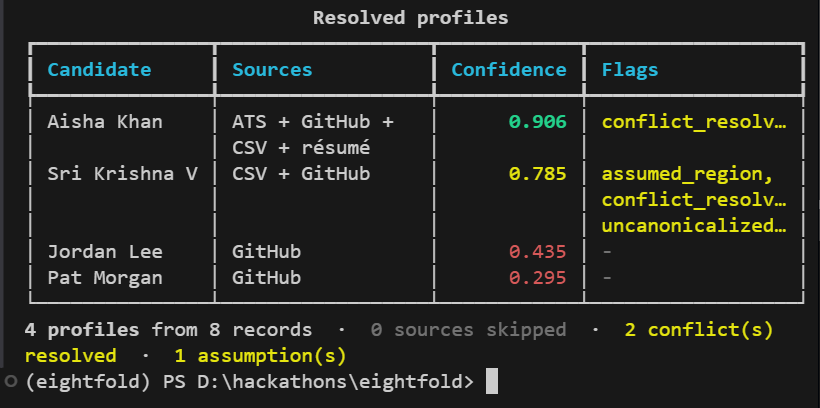
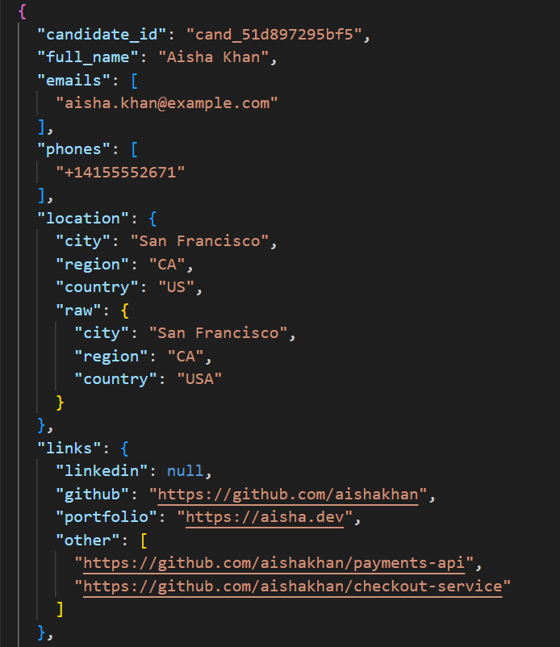
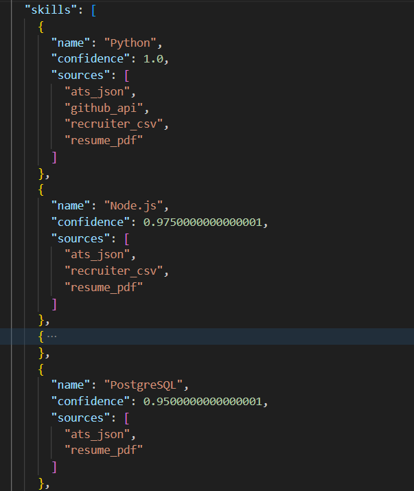
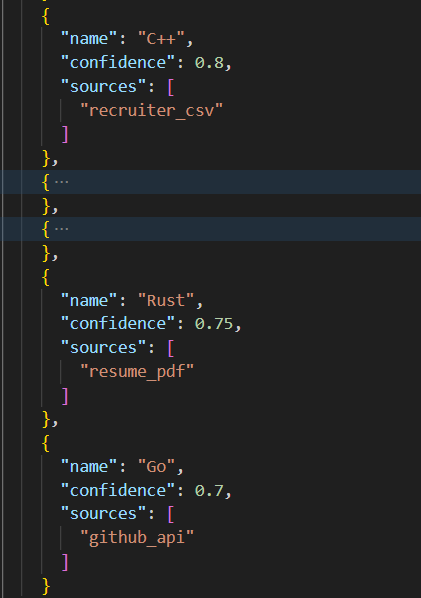
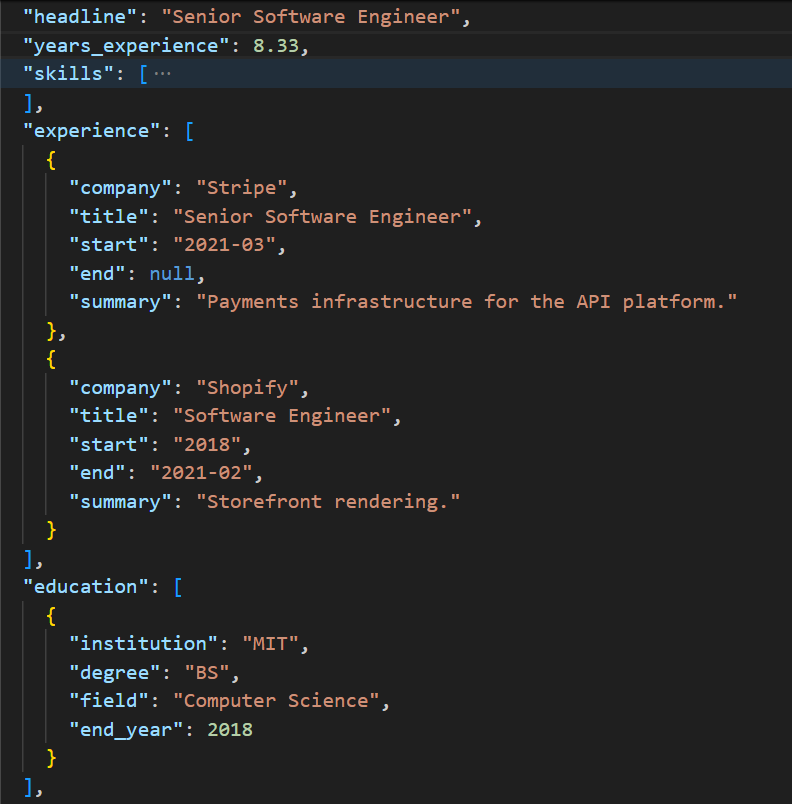
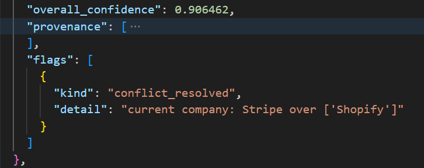
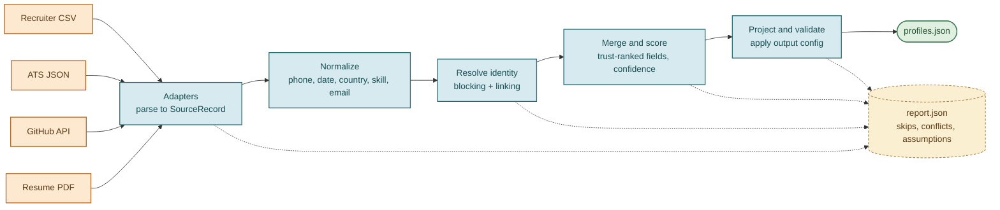
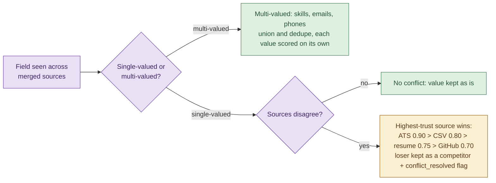
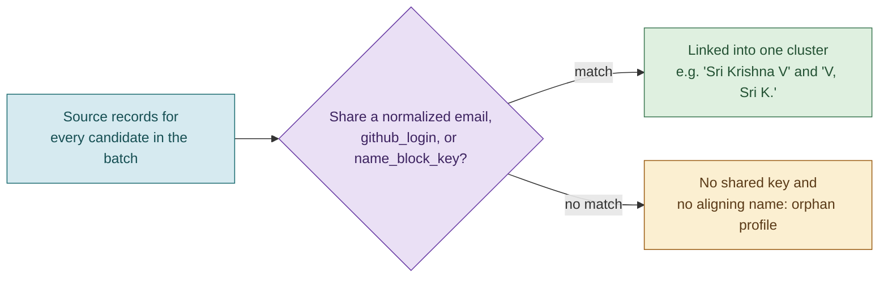

# Candidate Profile Transformation Pipeline

A batch pipeline that ingests candidate data from four heterogeneous sources
(recruiter CSV, ATS JSON, GitHub, and a résumé PDF), resolves which records
belong to the same person, merges them into one canonical profile per person
with per-field provenance and confidence, and emits output through a
runtime-configurable projection layer.



*Four people resolved from eight source records: confidence colored by tier,
and the flags that record every assumption and resolved conflict.*

> **Full documentation** lives in [`docs/`](docs/): a complete knowledge base
> covering the architecture, every stage, the data model, all design decisions
> and their rationale, edge-case handling, and how to extend the pipeline. Start
> at the [docs index](docs/README.md).

---

## Contents

- [Running it end to end](#running-it-end-to-end)
- [Sample output](#sample-output)
- [CLI flags](#cli-flags)
- [Testing](#testing)
- [Highlights](#highlights)
- [Architecture](#architecture)
- [Documentation](#documentation)
- [Design rationale](#design-rationale)
- [Configuration](#configuration)
- [Edge cases](#edge-cases)
- [Robustness](#robustness)
- [Descoped](#descoped)
- [Known limitations](#known-limitations)

---

## Running it end to end

### Prerequisites

- Python 3.11 or newer.
- Optional but recommended: [`uv`](https://docs.astral.sh/uv/) for
  environment and dependency management. Plain `pip` and `venv` work fine
  too; both paths are shown below.

### 1. Clone and enter the repository

```bash
git clone https://github.com/chanjhana/eightfold.git
cd eightfold
```

### 2. Install dependencies

With `uv` (recommended):

```bash
uv venv
uv pip install -e ".[dev]"
```

With plain `pip`:

```bash
python -m venv .venv
.venv/Scripts/activate       # Windows
# . .venv/bin/activate        # Linux or macOS
pip install -e ".[dev]"
```


### 3. Verify the install

```bash
uv run pytest            # or: pytest, if using plain pip
```

220 tests should pass in a few seconds. If they do, the environment is set up
correctly and every step below will work without surprises.

### 4. Run the pipeline against the bundled fixtures

```bash
uv run candidate-pipeline transform \
  --inputs csv=candidate_pipeline/data/fixtures/recruiter.csv \
           ats=candidate_pipeline/data/fixtures/ats.json \
           github=candidate_pipeline/data/fixtures/github.json \
           resume=candidate_pipeline/data/fixtures/resume.pdf \
  --default-region IN \
  --as-of 2026-06-30 \
  --out profiles.json \
  --report report.json \
  --pretty
```

This resolves the four fixture sources into four canonical profiles and
writes:

- **`profiles.json`**: one projected object per resolved person
  (`candidate_id`, `full_name`, `emails`, `phones`, `location`, `links`,
  `headline`, `years_experience`,
  `skills [{name, confidence, sources[]}]`, `experience`, `education`,
  `overall_confidence`, `provenance`).
- **`report.json`**: the batch's audit trail. Every skip, conflict,
  assumption, and count, so nothing that happened during the run is
  invisible.

### 5. Try a different output shape with no code change

```bash
uv run candidate-pipeline transform \
  --inputs csv=candidate_pipeline/data/fixtures/recruiter.csv \
           ats=candidate_pipeline/data/fixtures/ats.json \
           github=candidate_pipeline/data/fixtures/github.json \
           resume=candidate_pipeline/data/fixtures/resume.pdf \
  --config candidate_pipeline/data/configs/custom_config.json \
  --default-region IN \
  --as-of 2026-06-30 \
  --pretty
```

Same underlying data, a different shape: fields are renamed (`full_name`
becomes `name`), `skill_names` is a flat `string[]`, `name` carries inline
confidence, and `location` carries inline provenance. Pat Morgan is dropped
from this output because they have no email and `primary_email` is
`required: true` in this config, which demonstrates `on_missing: error`.

### 6. Skip the flags entirely

```bash
uv run bash ./demo.sh            # default schema, writes to sample_output/
uv run bash ./demo.sh custom     # custom config, writes to sample_output/
```

`demo.sh` is a bash script that calls the `candidate-pipeline` command
directly, so it needs that command on `PATH`. `uv run` takes care of that
without an explicit activation step. If you set up the environment with
plain `pip` instead, activate the virtual environment first
(`.venv/Scripts/activate` on Windows, `. .venv/bin/activate` on Linux or
macOS), then run `./demo.sh` directly. On Windows, run it from Git Bash or
WSL either way; `demo.sh` itself is a bash script.

### 7. Validate a config file on its own

```bash
uv run candidate-pipeline validate-config \
  --config candidate_pipeline/data/configs/custom_config.json
```

Useful for checking a hand-edited config before wiring it into a run:
duplicate or empty output paths, unknown types, and unknown `on_missing`
values are all rejected at load time.

---

## Sample output

Pre-computed output from the commands above is committed at
[`sample_output/`](sample_output/):

| File | Description |
|---|---|
| [`sample_output/profiles.json`](sample_output/profiles.json) | 4 profiles, default schema |
| [`sample_output/report.json`](sample_output/report.json) | Batch audit trail |
| [`sample_output/profiles_custom.json`](sample_output/profiles_custom.json) | 3 profiles, custom config (Pat Morgan dropped, no email) |

The pipeline resolves **4 people** from **8 source records** across 4 inputs:

| Person | Sources merged | Overall confidence |
|---|---|---|
| Aisha Khan | CSV + ATS + GitHub + résumé (4 sources) | **0.906** |
| Sri Krishna V | CSV + GitHub, name variants resolved | **0.785** |
| Jordan Lee | GitHub only, sparse | **0.435** |
| Pat Morgan | GitHub only, orphan (no shared identifier) | **0.295** |

### Anatomy of a resolved profile

Aisha Khan's record, merged from all four sources. Reading top to bottom:

Identity and contact, then a normalized location (`USA` becomes ISO `US` while
the original is preserved under `raw`), then links, with her top GitHub repos
surfaced under `other`:



Skills, confidence-sorted. Each skill's confidence tracks how many independent
sources corroborate it: Python sits at `1.0` because all four sources name it,
the three- and two-source skills follow, down to the single-source tail at
`0.70`–`0.75`. (Middle entries collapsed.)

| | |
|---|---|
|  |  |

Experience and education. The two companies here, Stripe and Shopify, are what
the conflict below resolves between; dates keep their original granularity, so
a year-only value like `2018` is never padded to a fake month:

| | |
|---|---|
|  |  |

Golden files used by the test suite are at [`tests/golden/`](tests/golden/).

---

## CLI flags

| Flag | Purpose |
|---|---|
| `--inputs key=path ...` | One or more sources. Keys: `csv`, `ats`, `github`, `resume`. Use `csv:label=path` for multiple files of one type. |
| `--config cfg.json` | Swap the projection layer. Omit for the built-in default schema. |
| `--default-region CC` | Resolves phones that lack a country code (e.g. recruiter CSV). |
| `--as-of YYYY-MM-DD` | Pins recency decay and `years_experience`. Defaults to today. |
| `--live` | Enriches each GitHub record from the real REST API (`GET /users/{login}/repos`). Falls back to the fixture on any error. Set `GITHUB_TOKEN` to raise the rate limit to 5,000/hr. |
| `--out path` | Write output JSON to a file (default: stdout). |
| `--report path` | Write the batch audit trail (skips, conflicts, assumptions, counts). |
| `--pretty` | Pretty-print JSON output. |
| `--strict` | Exit non-zero if any profile is dropped at the output stage (`on_missing: error` or a required miss). Graceful adapter skips are not strict failures. |

---

## Testing

```bash
uv run pytest            # 220 tests
```

| Test file | What it covers |
|---|---|
| `test_phone`, `test_dates`, `test_country`, `test_email`, `test_skills` | Per-normalizer units |
| `test_adapters` | Each source adapter loads its fixture into `SourceRecord`s; live GitHub overlay and fallback; bad or missing source skips, never crashes; registry wiring |
| `test_resume` | Résumé parser (`parse_resume_text`) and adapter units: clean and messy text, no fabrication, skill canonicalization, default-region phones, empty-text skip |
| `test_identity` | Variant collapse, orphan isolation, same-block precision |
| `test_merge` | Conflict resolution, asserted winner and confidence |
| `test_confidence` | Formula units plus the three overall anchors |
| `test_projection` | Default and custom config, assert-only normalize, `on_missing` |
| `test_e2e` | Full run against golden JSON (canonical and default output) |
| `test_garbage_source` | Malformed source, skip, batch continues |
| `test_normalizers_edge` | Silent-wrong and fabrication class coverage |
| `test_adapter_resilience` | Per-record survival, single-object ATS, null nesting, BOM, non-string scalars |
| `test_core_logic_edge` | Identity (login case, transitive, shared email), merge safety, confidence clamps, malformed paths |
| `test_config_validation` | Duplicate or empty path rejected, BOM config, bad type or `on_missing` |
| `test_torture_e2e` | All edge fixtures at once: survives, schema-valid, no fabrication, deterministic |
| `test_cli_strict` | `--strict` turns an output-stage drop into a non-zero exit |

Golden files (`tests/golden/`) are the contract. Edge suites assert
invariants (counts, "no crash", "missing becomes null"), not memorized
outputs.

---

## Highlights

- **Deterministic identity.** `candidate_id` is a SHA1 hash of the strongest
  stable anchor available (email, then phone, then a name-derived key), so
  re-running the pipeline on the same input always produces the same IDs and
  the same clustering.
- **A hard boundary at `CanonicalProfile`.** Everything upstream of merge
  (adapters, normalizers, identity resolution, scoring) has no idea a
  projection config exists. Only the `Projector` reads it. What the pipeline
  knows about a person stays separate from how a given consumer wants it
  shaped.
- **Nothing is silently dropped in a conflict.** When two trusted sources
  disagree on a single-valued field, the higher-trust source wins, but the
  losing value is kept as a `competitor` in provenance and flagged, not
  discarded.
- **Config `normalize` is an assertion, not a recompute.** All real
  normalization happens once, deterministically, upstream. A config that
  declares `normalize: "E164"` is checked against that shape; a mismatch is
  treated as missing rather than silently recomputed, which rules out
  double-normalization and drift.
- **The batch survives bad data.** A malformed CSV row, a corrupt PDF, a
  scanned résumé with no extractable text: each is skipped and logged, never
  a crash. About 95 of the 220 tests exist specifically to prove this against
  torture fixtures (encoding issues, null nesting, non-object JSON, vanity
  phone numbers, and more).
- **Confidence reflects real corroboration.** Agreement across independent
  sources raises confidence, values pulled from prose (a GitHub bio, résumé
  text) are penalized relative to structured fields, and stale time-varying
  fields (title, company) decay.

---

## Architecture



The hard boundary sits at **`CanonicalProfile`**: nothing upstream of it
knows a projection config exists, and the `Projector` is the only
config-aware component. This keeps what the pipeline knows about a person
cleanly separate from how a given consumer wants it shaped.

| Layer | Module | Responsibility |
|---|---|---|
| Sources | `sources/` | Parse each raw source into a normalized `SourceRecord`; never crash (try/except, skip and log) |
| Normalize | `normalize/` | Deterministic phone, date, country, skill, and email normalization |
| Resolve | `resolve/identity.py` | O(n) blocking plus precision linking into clusters of one person |
| Merge | `merge/` | Cluster into `CanonicalProfile`; trust-ranked conflict resolution |
| Confidence | `confidence/scorer.py` | All confidence constants and scoring, per-field and overall |
| Project | `project/` | Apply a config to a profile, producing a flat, validated output dict |
| Config | `config/` | Pydantic models for the config file, plus the loader |
| Models | `models/` | `CanonicalProfile`, `SourceRecord`, `RunReport` |

All tunable numbers live in exactly two places: `confidence/scorer.py` and
`merge/trust.py`.

### Sources

Two structured sources (recruiter CSV, ATS JSON) and two unstructured ones
(GitHub, résumé PDF):

- **GitHub** mirrors the real REST API shape (`/users/{login}` plus
  `/users/{login}/repos`). Non-fork repo languages canonicalize through the
  skill alias map and corroborate existing skills. The top two repos by
  stars surface as `links.other[]`. Forks are excluded, since their
  language and star counts reflect the upstream project rather than the
  candidate.
- **Résumé PDF** text is extracted with pypdf, then parsed by a
  deterministic heuristic parser (`parse_resume_text`): name, emails,
  phones, headline, location, and skills, each normalized through the same
  pipeline as every other source. Experience and education parsing stays an
  extension point; the parser only emits what it is confident about and
  never fabricates. Trust: **0.75** (above a GitHub bio, below CSV or ATS).
  A scanned or image-only PDF with no extractable text is an honest skip.

`--live` opts into the real GitHub REST API; any failure falls back to the
fixture record (logged to the report), so a demo run never flakes.

---

## Documentation

The [`docs/`](docs/) directory is a full knowledge base for the project, written
so someone new can get up to speed quickly. It goes well beyond this README.

| Document | Covers |
|---|---|
| [Overview](docs/01-overview.md) | Problem, goals, the three invariants, glossary |
| [Architecture](docs/02-architecture.md) | Stages, module map, the `CanonicalProfile` boundary, data flow |
| [Data model](docs/03-data-model.md) | `SourceRecord`, `CanonicalProfile`, `TrackedValue`, `RunReport` |
| [Sources and adapters](docs/04-sources.md) | The adapter framework and the four input sources |
| [Normalization](docs/05-normalization.md) | Phone, date, country, skill, and email normalizers |
| [Identity resolution](docs/06-identity-resolution.md) | Blocking, linking, clustering |
| [Merge and confidence](docs/07-merge-and-confidence.md) | Conflict resolution and confidence scoring |
| [Projection and configuration](docs/08-projection-and-config.md) | Runtime output shaping and validation |
| [CLI reference](docs/09-cli-reference.md) | Commands, flags, output modes, exit codes |
| [Design decisions](docs/10-design-decisions.md) | Every significant choice and its rationale |
| [Edge cases and robustness](docs/11-edge-cases.md) | Hostile-input handling and deliberate scope limits |
| [Testing](docs/12-testing.md) | Test organization, golden files, invariants |
| [Extending the pipeline](docs/13-extending.md) | Adding sources, normalizers, and output shapes |

Each document links to the exact source files it describes and includes flow and
architecture diagrams. Start at the [docs index](docs/README.md).

---

## Design rationale

### Trust order and conflict resolution

Single-valued fields (name, current company or title, location) are
resolved by **source trust**:
`ATS (0.90) > CSV (0.80) > résumé (0.75) > GitHub (0.70)`.
The winner is kept; losing values are retained as `competitors` in
provenance, never discarded. A conflict raises a `Flag(conflict_resolved)`
on the profile and a `ConflictEntry` in the `RunReport`. Multi-valued fields
(skills, emails, phones) are unioned and deduped instead of contested.



### Confidence scoring

```
single-valued = clamp01(base + corroboration − extraction_penalty − conflict_penalty) × recency
multi-valued  = clamp01(best_base + corroboration − extraction_penalty) × recency
```

- **corroboration**: +0.05 per additional agreeing source, weighted by
  independence (ATS↔CSV = 0.5, since they may share an upstream import;
  anything↔GitHub = 1.0), capped at +0.10.
- **extraction_penalty**: 0.10 for prose or heuristic values (a GitHub bio,
  résumé free text), 0 for structured values.
- **conflict_penalty**: 0.05 when two or more distinct values competed
  (single-valued fields only).
- **recency**: decays only time-varying fields (company, title, location,
  headline) by 1% per month stale, capped at 20%.

### Identity resolution

**Blocking** (an O(n) hashmap) groups records sharing any of: a normalized
email, `github_login`, or `name_block_key` (sorted first letters of name
tokens, so "Sri Krishna V", "Sri Krishna Vijayarajan", and "V, Sri K." all
key to `ksv`). **Linking** then applies positive-evidence tiers: an exact
email or login match links outright; otherwise initial-aware name-token
alignment plus a corroborating identifier links at a threshold of 0.70 or
higher. There is no all-pairs fuzzy matching; comparisons only happen within
a shared block, which keeps the whole step O(n).



### Config `normalize` is assert-only

All normalization happens deterministically upstream, in `normalize/`. A
config's `normalize: "E164"` is a **format assertion**, not a recompute: the
projector verifies the value matches and treats a mismatch as missing. This
rules out double-normalization and silent drift between the canonical model
and the output.

### Core principles

Never fabricate a value (year-only dates stay `YYYY`; a month is never
invented). Never crash the batch on one bad record. Keep `candidate_id`
deterministic (a hash of email, then phone, then `name_block_key`) so
reruns and golden tests stay stable.

---

## Configuration

`data/configs/default_config.json` is the schema the CLI uses when
`--config` is omitted. `data/configs/custom_config.json` renames fields,
inlines confidence and provenance, and reshapes `skills` into a flat
`string[]`, all at runtime with no code change.

The path resolver supports `field`, `field.sub`, `field[].sub` (map over an
array), and `field[N]` (index, e.g. `emails[0]`).

### `on_missing` and `--strict`

`on_missing` (`null`, `omit`, or `error`) and `required: true` decide what
happens when a projected value is absent. A dropped profile is recorded as a
`projection` skip and the batch continues (exit 0) by default. Pass
`--strict` to turn any output-stage drop into a non-zero exit, for CI use.
Graceful adapter or record skips are not strict failures.

---

## Edge cases

Each edge case below is exercised by a dedicated fixture and asserted in a
test.

| # | Edge case | Where |
|---|---|---|
| 1 | Company conflict, trust winner plus competitors plus flag | A (ATS > CSV), B (CSV > GitHub); `test_merge` |
| 2 | Name variants, no shared email; blocked and linked; orphan stays separate | B links by `name_block_key`; Pat Morgan orphaned; `test_identity` |
| 3 | Garbage source; skip, batch continues | `test_garbage_source` |
| 4 | Phone with no country code; `--default-region` plus flag plus assumption | B's CSV phone; `test_merge` |
| 5 | Partial or "Present" dates; granularity preserved, `years_experience` still computes | A's ATS experience; `test_dates`, `test_merge` |
| 6 | Skill alias plus unknown skill; `ReactJS` becomes `React`, `C++`/`C#`/`.NET` stay intact, unknown kept verbatim plus flag | `test_skills`, `test_merge` |

---

## Robustness

Beyond the demo fixtures, synthetic torture fixtures (`data/fixtures/edge/`)
and about 95 edge tests probe the pipeline against hostile inputs:

- **Per-record resilience**: one poison row or object is skipped and logged
  (`record:<source>` in the report); the rest of the file still loads.
- **Shape tolerance**: a top-level JSON object (not an array) is accepted;
  explicit `null` nested values and non-object array elements degrade
  gracefully.
- **Encoding tolerance**: a UTF-8 BOM is stripped in CSV, JSON, and configs;
  CSV headers are matched case- and whitespace-insensitively; output is
  always written UTF-8, so names like `李明` or `José` never crash stdout.
- **No silent-wrong values**: `mailto:` prefixes and trailing punctuation
  are cleaned from emails; an out-of-range month like `2020-13` is rejected,
  never padded into a fake date; skills split on `, ; | ⏎ ⇥` but not on
  `/`, so `CI/CD` stays intact.
- **Config validation**: duplicate or empty output `path`s are rejected at
  load time (a duplicate used to silently overwrite a previous field,
  causing data loss).
- **Multiple files per type**: `--inputs csv:primary=a.csv csv:backfill=b.csv`.

Genuinely hard problems are deliberately descoped and pinned by a test with
a comment: shared inbox linking two different people, `Georgia` the country
versus the US state, and vanity phone letters like `1-800-FLOWERS`.

---

## Descoped

Each item below was deliberately left out, with a clear extension point
noted.

| What | Why descoped | Extension point |
|---|---|---|
| LinkedIn / recruiter notes | No public API, NLP-heavy | Another `SourceAdapter` in the same registry; `link_hints` already accommodates a LinkedIn URL |
| Résumé experience/education | Free-form date parsing is unreliable; scope kept lean | `parse_resume_text`'s section-aware parser is where that logic slots in |
| Fuzzy / embedding name matching | Alias-map plus blocking is deterministic; fuzzy matching adds non-determinism | The identity linker's tiered structure has a clean insertion point |
| Embedding-based skill canonicalization | The alias map covers common vocabulary; the long tail needs a model | `canonicalize_skill` has a single insertion point for an optional embedding fallback before verbatim matching; the method would be `normalize:skill-embedding`, off by default so goldens stay byte-identical |
| Recency decay when no timestamp | Fully implemented; documented as ×1.0 when `last_updated` is absent | Already wired through the `last_updated` hook |

## Known limitations

- A GitHub record with no email or login and a non-aligning name stays
  orphaned (Pat Morgan in the fixtures). Fuzzy name matching is the
  production extension for this.
- Free-text country resolution is best-effort; ambiguous tokens (for
  example, a bare state code) may not resolve, in which case country is
  left `null` with the raw value preserved.
