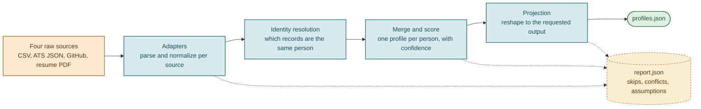

# 01. Overview

## The problem

Talent data about a single person arrives from many systems, and no two systems
agree on format or completeness. A recruiter exports a CSV. An applicant
tracking system (ATS) emits nested JSON. GitHub exposes a public profile and a
list of repositories. A candidate uploads a resume as a PDF. The same person can
appear in several of these, under slightly different names, with different
subsets of their information, formatted in incompatible ways.

The pipeline's job is to take these heterogeneous records and produce, for each
real person, **one canonical profile**: a single record that combines everything
known about them, remembers where each piece of information came from, attaches a
confidence score to every value, and can be reshaped on demand for whatever
downstream consumer needs it.

## What the pipeline produces

For a batch of input files, it emits:

- **`profiles.json`**: one object per resolved person. Each object carries
  identity (name, emails, phones), a normalized location, links, a headline,
  skills with confidence, work experience, education, an overall confidence
  score, and a provenance trail.
- **`report.json`**: a batch audit trail: every record that was skipped, every
  conflict that was resolved, every assumption that was made, and summary counts.

The output shape is not fixed. A runtime configuration file decides which fields
appear, what they are named, and whether confidence and provenance are included,
all without changing code. See [Projection and configuration](08-projection-and-config.md).

## The three invariants

Every design decision in the project serves one of three rules. When two
approaches were possible, the one that upheld these won.

1. **Never fabricate a value.** If the input says a job started in `2018` with no
   month, the output says `2018`, not `2018-01`. If a phone number has no country
   code and none can be safely inferred, the raw value is kept and no E.164 number
   is invented. Absence is represented honestly, never filled in with a guess.

2. **Never crash the batch on one bad record.** A malformed CSV row, a corrupt
   PDF, a JSON object where an array was expected: each is caught, recorded in the
   report as a skip, and stepped over. One poison record never takes down the
   other records in its file, and one bad file never takes down the other sources.

3. **Deterministic and explainable output.** The same inputs always produce byte
   identical output, including the identifiers assigned to people. Every value in
   the output can be traced back through provenance to the source record and
   method that produced it. Nothing is random, and nothing is a black box.

These are referenced throughout the rest of the documentation. When a piece of
code looks more cautious than necessary, it is almost always upholding invariant
1 or 2.

## The mental model in one diagram

The full stage-by-stage version, with the internal record types labeled, is in
[Architecture](02-architecture.md).

## Glossary

These terms appear throughout the code and the documentation. Learning them first
makes everything else easier to read.

| Term | Meaning |
|---|---|
| **Source** | One input system: `recruiter_csv`, `ats_json`, `github_api`, or `resume_pdf`. |
| **Adapter** | The component that reads one source's raw format and produces `SourceRecord`s. See [Sources](04-sources.md). |
| **SourceRecord** | One raw record from one source, after normalization, with each field carrying both its raw and normalized form. |
| **Normalization** | Converting a raw value into a canonical format (phone to E.164, country to ISO code, and so on). See [Normalization](05-normalization.md). |
| **Identity resolution** | Deciding which `SourceRecord`s belong to the same person. See [Identity resolution](06-identity-resolution.md). |
| **Blocking** | The fast, high-recall first pass of identity resolution that groups records that might match. |
| **Linking** | The precise second pass that decides which blocked records actually match. |
| **Cluster** | A group of `SourceRecord`s that resolution decided are one person. |
| **Merge** | Combining a cluster into one profile. See [Merge and confidence](07-merge-and-confidence.md). |
| **CanonicalProfile** | The merged, single-person record. This is the central data structure and a hard architectural boundary. |
| **TrackedValue** | A value plus its confidence, contributing sources, provenance, and any competing values that lost a conflict. |
| **Provenance** | The record of which source and method produced a value. |
| **Trust** | A fixed per-source weight used to pick a winner when sources disagree. |
| **Confidence** | A 0 to 1 score attached to each value, reflecting corroboration, extraction quality, conflict, and recency. |
| **Projection** | Turning a `CanonicalProfile` into an output dict according to a configuration. |
| **Projector** | The only component that reads the output configuration. See [Projection](08-projection-and-config.md). |
| **RunReport** | The batch-level audit trail threaded through every stage. |
| **Flag** | A per-profile note about something noteworthy during merge (a resolved conflict, an assumed region). |
| **candidate_id** | The deterministic identifier assigned to each resolved person. |

## Where to go next

- To see how the stages fit together and which module owns each one, read [Architecture](02-architecture.md).
- To understand the records that flow between stages, read [Data model](03-data-model.md).
