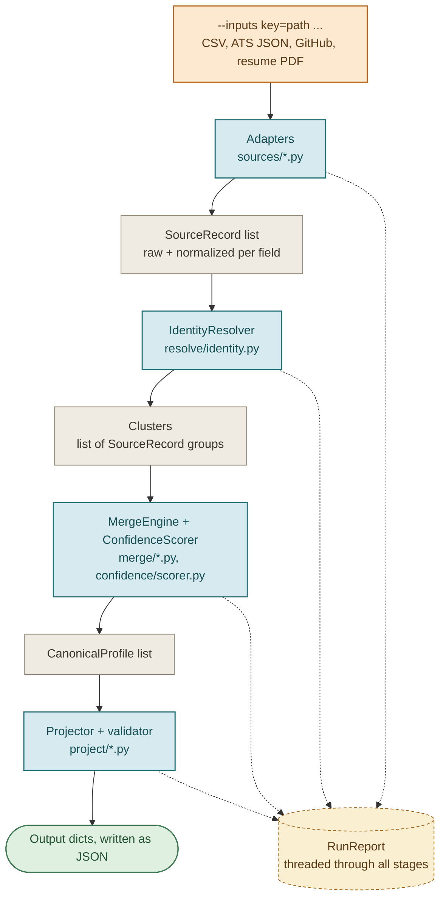
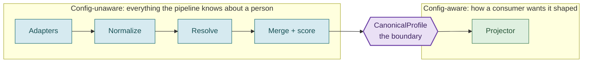

# 02. Architecture

This document explains how the stages fit together, which module owns each one,
and the single boundary that keeps the design clean.

## The full pipeline

The pipeline is a linear sequence of stages. Each stage has one responsibility and
hands a well-defined data structure to the next. A single `RunReport` object is
threaded through every stage to collect skips, conflicts, assumptions, and counts.



The orchestration lives in [`pipeline.py`](../candidate_pipeline/pipeline.py),
which is the only place the stages are wired together. Its `run_pipeline`
function calls `resolve_and_merge` (adapters through merge) and then
`project_profiles` (projection and validation), returning the output dicts, the
canonical profiles, and the report.

## Stage responsibilities

| Stage | Module | Input | Output | Detailed doc |
|---|---|---|---|---|
| Adapt | [`sources/`](../candidate_pipeline/sources/) | File paths | `SourceRecord` list | [Sources](04-sources.md) |
| Normalize | [`normalize/`](../candidate_pipeline/normalize/) | Raw field values | Canonical values | [Normalization](05-normalization.md) |
| Resolve | [`resolve/identity.py`](../candidate_pipeline/resolve/identity.py) | `SourceRecord` list | Clusters | [Identity resolution](06-identity-resolution.md) |
| Merge | [`merge/`](../candidate_pipeline/merge/) | One cluster | One `CanonicalProfile` | [Merge and confidence](07-merge-and-confidence.md) |
| Score | [`confidence/scorer.py`](../candidate_pipeline/confidence/scorer.py) | Merge contributions | Confidence values | [Merge and confidence](07-merge-and-confidence.md) |
| Project | [`project/`](../candidate_pipeline/project/) | `CanonicalProfile` + config | Output dict | [Projection](08-projection-and-config.md) |

Normalization is drawn as its own stage above, but in code it runs *inside* the
adapters: each adapter calls the normalizers as it reads a field, so a
`SourceRecord` is already normalized by the time it leaves an adapter. It is
treated as a conceptually separate stage because the normalizers are pure,
independently tested functions with no knowledge of any source.

## The one boundary that matters: CanonicalProfile

The most important structural rule in the project is this:

> Nothing upstream of `CanonicalProfile` knows that an output configuration
> exists. The `Projector` is the only component that reads the config.



Why this matters:

- **Separation of concerns.** "What we know about a person" is computed once and
  is completely independent of "how a given consumer wants it presented." The
  merge logic never has to think about output field names, and the projector
  never has to think about trust or corroboration.
- **Runtime flexibility with zero code change.** Because the config only affects
  the projector, a new output shape is a new JSON file, not a code change. See the
  default versus custom comparison in [Projection](08-projection-and-config.md).
- **Testability.** The canonical profiles can be asserted against golden files
  independently of any projection, and projections can be tested against a fixed
  canonical profile.

The boundary is enforced by structure, not convention: the config type
(`ProjectionConfig`) is only imported by [`project/`](../candidate_pipeline/project/),
[`config/`](../candidate_pipeline/config/), and the orchestrator and CLI. No
adapter, normalizer, resolver, or merge module imports it.

## Module map

```
candidate_pipeline/
  pipeline.py            Orchestration: wires the stages, threads the RunReport
  cli.py                 Command-line entry: transform, validate-config
  console_report.py      Human-facing terminal rendering (rich), stderr only

  models/                The data structures passed between stages
    source_record.py       SourceRecord, SourceValue, SourceExperience, SourceEducation
    canonical.py           CanonicalProfile, TrackedValue, ProvenanceEntry, Flag, RepoEntry, ...
    report.py              RunReport, SkipEntry, ConflictEntry, Assumption

  sources/               One adapter per input source (Stage: Adapt)
    base.py                SourceAdapter ABC + shared resilience/normalization helpers
    registry.py            Maps --inputs keys (csv/ats/github/resume) to adapter classes
    recruiter_csv.py       Recruiter CSV adapter
    ats_json.py            ATS JSON adapter
    github_api.py          GitHub adapter (with optional live REST fetch)
    resume_pdf.py          Resume PDF adapter + deterministic text parser

  normalize/             Pure normalization functions (Stage: Normalize)
    phone.py               To E.164
    dates.py               To YYYY or YYYY-MM
    country.py             To ISO-3166 alpha-2
    skills.py              Alias map + skill splitting
    email.py               Lowercase + shape validation
    aliases.json           The skill alias table

  resolve/               Identity resolution (Stage: Resolve)
    identity.py            Blocking + linking + union-find clustering

  merge/                 Cluster to profile (Stage: Merge)
    engine.py              The MergeEngine: field-by-field merge, candidate_id, years
    strategies.py          Single-valued and multi-valued merge strategies
    trust.py               SOURCE_TRUST constants

  confidence/            Confidence scoring (Stage: Score)
    scorer.py              All confidence constants and scoring functions

  project/               Projection (Stage: Project) -- the only config-aware code
    projector.py           Builds the view, asserts formats, shapes output
    resolver.py            The path mini-language (field, field.sub, field[].sub, field[N])
    validator.py           Builds a Pydantic model from the config and validates output

  config/                The output configuration
    schema.py              FieldSpec and ProjectionConfig models
    loader.py              Loads and validates a config file; holds DEFAULT_CONFIG

  data/
    configs/               default_config.json, custom_config.json
    fixtures/              Demo inputs and hostile "edge" inputs
```

Two files are called out in comments as the only places tunable numbers live:
[`merge/trust.py`](../candidate_pipeline/merge/trust.py) (source trust) and
[`confidence/scorer.py`](../candidate_pipeline/confidence/scorer.py) (all
confidence constants). If you want to change how the pipeline weighs sources or
scores values, those are the two files to edit.

## How the RunReport is threaded

The `RunReport` is created once in `run_pipeline` and passed by reference into
every stage. Stages never return errors up the call stack for normal bad-input
handling; instead they append to the report and continue. This is the mechanism
behind invariant 2 (never crash the batch). The report accumulates:

- **skips**: records or whole sources that could not be read, with the stage and reason.
- **conflicts**: single-valued fields where two sources disagreed and trust picked a winner.
- **assumptions**: places where a configured default was applied, such as a default phone region.
- **counts**: `records_in`, `records_skipped`, `clusters`, `profiles_out`, `sources_skipped`.

See [Data model](03-data-model.md) for the report's structure and
[Edge cases](11-edge-cases.md) for the full catalog of what lands in it.

## Where to go next

- [Data model](03-data-model.md) describes the three record types in detail.
- Then follow the stages in order: [Sources](04-sources.md), [Normalization](05-normalization.md), [Identity resolution](06-identity-resolution.md), [Merge and confidence](07-merge-and-confidence.md), [Projection](08-projection-and-config.md).
