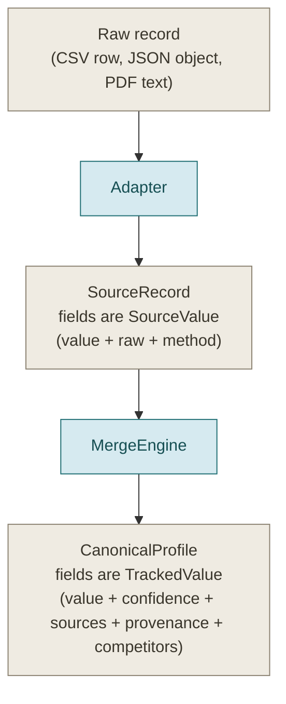

# 03. Data model

Three families of data structures flow through the pipeline. Understanding them
is the fastest way to understand the whole system, because every stage is defined
by what it takes in and what it produces.

- **`SourceRecord`** and friends: what an adapter produces from one raw record.
- **`CanonicalProfile`** and friends: the merged, single-person record.
- **`RunReport`** and friends: the batch audit trail.

All of them are [Pydantic](https://docs.pydantic.dev/) models, which gives free
validation and JSON serialization.

## Relationship at a glance

The key difference between the two record types: a `SourceValue` (in a
`SourceRecord`) carries the raw and normalized forms of one source's single
value. A `TrackedValue` (in a `CanonicalProfile`) carries the *winning* value
across all sources, plus its confidence, the sources that agreed, the full
provenance trail, and any values that lost a conflict.

## SourceRecord

Defined in [`models/source_record.py`](../candidate_pipeline/models/source_record.py).
One `SourceRecord` is one raw record from one source, after normalization.

### SourceValue

The atom of a source record. Every scalar field on a `SourceRecord` is a
`SourceValue` so that both the raw and the normalized form travel together.

| Field | Type | Meaning |
|---|---|---|
| `value` | any | Post-normalization value |
| `raw` | any | Pre-normalization value, kept for provenance |
| `method` | string | How it was produced, for example `csv:column`, `normalize:e164` |

### SourceRecord fields

| Field | Type | Notes |
|---|---|---|
| `source_name` | string | `recruiter_csv`, `ats_json`, `github_api`, or `resume_pdf` |
| `record_id` | string | Stable-ish id for skip and audit logging |
| `full_name` | SourceValue | Identity |
| `emails` | list of SourceValue | Multi-valued |
| `phones` | list of SourceValue | Multi-valued |
| `github_login` | SourceValue | Used as an identity anchor and to build the GitHub link |
| `current_company` | SourceValue | Flat current employer; reconciled into the current experience entry at merge |
| `current_title` | SourceValue | Flat current title; same reconciliation |
| `location` | SourceValue | The `value` is a dict `{city, region, country}`; `raw` keeps the original |
| `headline` | SourceValue | Free-text, for example a GitHub bio |
| `skills` | list of SourceValue | Each already alias-normalized |
| `experience` | list of SourceExperience | Structured work history |
| `education` | list of SourceEducation | Structured education |
| `repos` | list of RepoEntry | Raw GitHub repos, including forks at this stage |
| `link_hints` | dict | Raw hints such as `github_login`, `blog`, `notable_repos` |
| `last_updated` | string | ISO timestamp; drives recency decay in scoring |
| `flags` | list of Flag | Normalization-time notes such as `assumed_region`, lifted onto the profile at merge |

`SourceExperience` and `SourceEducation` mirror the canonical shapes below but use
`SourceValue` for each field. `SourceRecord.primary_email()` returns the first
non-empty email, used as a stable record id and identity anchor.

## CanonicalProfile

Defined in [`models/canonical.py`](../candidate_pipeline/models/canonical.py).
This is the merged, single-person record and the architectural boundary described
in [Architecture](02-architecture.md).

### TrackedValue

The atom of a canonical profile, and the reason the output is explainable. Every
merged value is a `TrackedValue`.

| Field | Type | Meaning |
|---|---|---|
| `value` | any | The winning value |
| `confidence` | float or null | 0 to 1 score; null for values that are not scored (for example `links`) |
| `sources` | list of string | The sources that agreed on this value |
| `provenance` | list of ProvenanceEntry | Every contributing source, with raw and normalized forms |
| `competitors` | list | Values that lost a single-valued conflict, never discarded |

`competitors` is central to invariant 1. When two sources disagree on a
single-valued field, the loser is not dropped; it is preserved here so nothing is
silently lost.

### ProvenanceEntry

| Field | Type | Meaning |
|---|---|---|
| `source` | string | Which source contributed |
| `method` | string | How, for example `csv:column`, `normalize:e164`, `resume:heuristic` |
| `raw` | any | Pre-normalization value |
| `value` | any | Post-normalization value |

### CanonicalProfile fields

| Field | Type | Notes |
|---|---|---|
| `candidate_id` | string | Deterministic hash of the strongest stable anchor (see below) |
| `full_name` | TrackedValue | |
| `emails` | list of TrackedValue | Confidence-sorted |
| `phones` | list of TrackedValue | Confidence-sorted |
| `location` | TrackedValue | `value` is `{city, region, country, raw}` |
| `links` | TrackedValue | `value` is `{linkedin, github, portfolio, other[]}`; not confidence-scored |
| `headline` | TrackedValue | Time-varying, so it decays with staleness |
| `skills` | list of TrackedValue | Each scored independently, confidence-sorted |
| `experience` | list of TrackedExperience | The current entry has `end == None` |
| `education` | list of TrackedEducation | |
| `repos` | list of RepoEntry | The person's own non-fork repos, star-sorted |
| `years_experience` | float or null | Computed from merged, de-overlapped intervals |
| `overall_confidence` | float | Weighted sum over core fields |
| `flags` | list of Flag | Merge-time notes |

`TrackedExperience` has `company`, `title`, `start`, `end`, `summary`, each a
`TrackedValue`. `end == None` marks the current role. `TrackedEducation` has
`institution`, `degree`, `field`, `end_year`.

### Flag and RepoEntry

`Flag` is a per-profile note with a `kind` and a `detail`. Known kinds:
`conflict_resolved`, `assumed_region`, `uncanonicalized_skill`.

`RepoEntry` trims a GitHub repository to `name`, `language`, `stars`, `url`, and
`fork`. On the canonical profile these are the person's own non-fork repos,
star-sorted; the `language` also feeds `skills` and the `url` feeds `links`.

### How candidate_id is chosen

`candidate_id` is a deterministic SHA1 hash of the strongest stable anchor
available across the cluster, in priority order:

1. The lowest-sorted email, if any email exists.
2. Otherwise the lowest-sorted phone.
3. Otherwise the name block key (see [Identity resolution](06-identity-resolution.md)) of the first name.

Because the anchor is chosen deterministically and hashed, re-running the
pipeline on the same input always yields the same ids, which is what makes the
golden tests stable. The implementation is `_candidate_id` in
[`merge/engine.py`](../candidate_pipeline/merge/engine.py).

## RunReport

Defined in [`models/report.py`](../candidate_pipeline/models/report.py). The
batch-level audit trail, distinct from per-profile `flags`. It records what
happened to the *batch*.

| Field | Type | Meaning |
|---|---|---|
| `skips` | list of SkipEntry | Records or sources that could not be processed |
| `conflicts` | list of ConflictEntry | Single-valued disagreements resolved by trust |
| `assumptions` | list of Assumption | Configured defaults that were applied |
| `counts` | dict of string to int | `records_in`, `records_skipped`, `clusters`, `profiles_out`, `sources_skipped` |

- `SkipEntry` has `stage` (for example `adapter:recruiter_csv`, `record:ats_json`, `projection`), `identifier`, and `reason`.
- `ConflictEntry` has `candidate_id`, `field`, `winner`, `losers`.
- `Assumption` has `candidate_id`, `field`, `assumption`.

Two helper methods keep call sites terse: `add_skip(stage, identifier, reason)`
and `bump(key, amount)`.

The `stage` prefix on a skip encodes what failed: `adapter:` means a whole source
file could not be read, `record:` means one record inside a file was skipped
while the rest loaded, `normalize:` means a single value failed validation, and
`projection` or `validation` means a profile was dropped at the output stage. The
CLI's `--strict` flag keys off these prefixes; see [CLI reference](09-cli-reference.md).

## Where to go next

- [Sources](04-sources.md) shows how each adapter builds a `SourceRecord`.
- [Merge and confidence](07-merge-and-confidence.md) shows how `SourceRecord`s become a `CanonicalProfile`.
