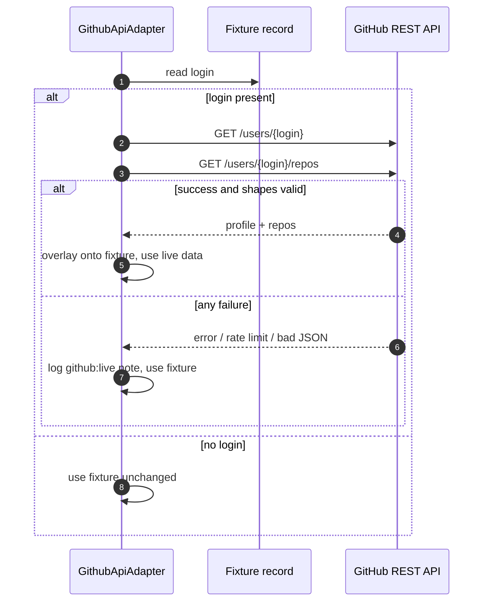

# 04. Sources and adapters

The first stage reads raw input. Each input format has its own adapter, but they
all share one framework that guarantees invariant 2: a bad source or record is
skipped and logged, never a crash.

## The adapter framework

`SourceAdapter` in [`sources/base.py`](../candidate_pipeline/sources/base.py) is
the abstract base class. Its public `load` method wraps the subclass's
`_load_impl` in a try/except:

```python
def load(self, path: str) -> list[SourceRecord]:
    try:
        return self._load_impl(path)
    except Exception as exc:
        self.report.add_skip(f"adapter:{self.source_name}", str(path), f"{type(exc).__name__}: {exc}")
        return []
```

This is the outermost safety net. If an entire file is unreadable (missing,
corrupt, wrong format), the whole source is skipped with an `adapter:` entry in
the report, and the other sources still run. Inside `_load_impl`, adapters catch
per-record errors too, logging a `record:` skip so one poison row does not drop
the rest of the file. The two levels of skip are visible in the report by their
stage prefix.

### Shared helpers

The base class provides helpers every adapter uses, which centralizes both
robustness and normalization:

| Helper | Purpose |
|---|---|
| `_as_record_list(data)` | Tolerates a top-level JSON object where an array was expected by wrapping it in a list. Anything that is neither list nor dict yields no records. |
| `_record_skip(path, index, exc)` | Logs a per-record skip (`record:<source>`) so one bad record never drops the rest. |
| `_emails(raws, method)` | Normalizes each email; an invalid one is dropped (with a `normalize:email` skip), not the record. |
| `_phones(raws, method, flags)` | Normalizes each phone to E.164; raises an `assumed_region` flag when a default region was applied. |
| `_skills(raws, flags)` | Canonicalizes each skill through the alias map; raises `uncanonicalized_skill` for unknowns. |

Because normalization is funneled through these helpers, every source is
normalized the same way. A skill from a resume and a skill from a CSV go through
the identical `canonicalize_skill` path.

### The registry

[`sources/registry.py`](../candidate_pipeline/sources/registry.py) maps the
`--inputs` keys to adapter classes:

| Key | Adapter |
|---|---|
| `csv` | `RecruiterCsvAdapter` |
| `ats` | `AtsJsonAdapter` |
| `github` | `GithubApiAdapter` |
| `resume` | `ResumePdfAdapter` |

A key may carry an optional `:label` so several files of the same type can be
ingested in one run, for example `csv:primary=a.csv csv:backfill=b.csv`. The label
disambiguates the input map; the part before the colon selects the adapter.

## The four sources

The two structured sources (CSV and ATS) provide clean fields. The two
unstructured sources (GitHub and resume) provide free text that has to be parsed
heuristically, which is why they are trusted less and their extracted values are
penalized in scoring. See [Merge and confidence](07-merge-and-confidence.md) for
the trust order.

### Recruiter CSV

[`sources/recruiter_csv.py`](../candidate_pipeline/sources/recruiter_csv.py). The
clean identity anchor: a flat table with `full_name`, `email`, `phone`,
`current_company`, `current_title`, `city`, `country`, and `skills`.

Robustness details worth knowing:

- The file is opened with `utf-8-sig`, which transparently strips a byte-order
  mark. Without this, an invisible BOM would prefix the first header (it would
  read as `<BOM>full_name` rather than `full_name`) and silently fail to match.
- Headers are lowercased and trimmed, so `" Full_Name "` matches the canonical
  `full_name`.
- Rows are consumed one at a time inside a try/except. A `csv.Error` (for example
  an embedded NUL byte) skips that row and continues.
- Skills are split with `split_skills`, which separates on comma, semicolon, pipe,
  newline, and tab, but deliberately not on `/`, so `CI/CD` stays intact.

### ATS JSON

[`sources/ats_json.py`](../candidate_pipeline/sources/ats_json.py). Nested JSON
whose field names do not match the canonical schema; this adapter maps them
(`candidate.fullName`, `candidate.emails`, `employment.current`, `experience[].employer`,
and so on). ATS is the highest-trust source.

Robustness details:

- `obj.get("candidate") or {}` is used instead of `obj.get("candidate", {})`. The
  `or {}` form defends against an explicit `"candidate": null`, which the default
  form would not catch.
- A non-object entry in `experience` or `education` is skipped rather than
  crashing the record.
- Experience dates go through `normalize_date`, which returns `None` for
  `"Present"` or empty (marking an ongoing role).

### GitHub

[`sources/github_api.py`](../candidate_pipeline/sources/github_api.py). Reads a
cached JSON fixture shaped like the real REST API (`/users/{login}` plus
`/users/{login}/repos`). Company, location, and bio are free text.

Repositories are handled with care, because they feed three parts of the profile:

- Each non-fork repo's `language` becomes a skill, through the same alias map as
  any other skill.
- The most-starred non-fork repos (top two) become profile links under
  `links.other`.
- The person's own non-fork repos become `CanonicalProfile.repos`, star-sorted.

Forks are excluded from all three, because a fork's language and star count
reflect the upstream project, not the candidate's own work. Malformed repo
entries (a non-object, a repo with no name) are skipped, never stringified into
junk. Scalar coercion is defensive: a numeric `login` becomes its string form, a
list or dict where a name was expected is treated as absent.

#### The --live path

With `--live`, the adapter enriches each fixture record from the real GitHub REST
API, keyed by `login`. On any failure (no login, network error, rate limit, bad
JSON) it returns the fixture object unchanged and logs a non-fatal `github:live`
note, so a live run never crashes or flakes. An optional `GITHUB_TOKEN` raises the
rate limit from 60 to 5,000 requests per hour.



### Resume PDF

[`sources/resume_pdf.py`](../candidate_pipeline/sources/resume_pdf.py). A resume
is candidate-authored prose, so this is the second unstructured source. Text is
extracted from a PDF with `pypdf` (or read directly from a `.txt` twin), then a
deterministic heuristic parser, `parse_resume_text`, pulls out the fields it can
recover reliably: name, emails, phones, headline, location, and skills.

Scope is deliberately lean. Experience and education parsing is left as an
extension point, because free-form resume date parsing is unreliable and inventing
structure would risk invariant 1. The parser only emits what it is confident
about; anything it cannot recover stays absent.

Notable behavior:

- A scanned or image-only PDF yields no extractable text. That is an honest skip
  (`adapter:resume_pdf`, reason "no extractable text"), not a crash.
- The name heuristic looks for an early line of one to four alphabetic tokens with
  no digits, no at sign, and no URL, that is not a known section header.
- The location heuristic prefers an explicit `Location:` label, then falls back to
  an early `City, Country`-shaped line whose tail resolves to a real country.
- A phone-like run must contain at least eight digits to be taken as a phone, so a
  year or id is not mistaken for one.

## Trust summary

| Source | Trust | Structured? | Notes |
|---|---|---|---|
| `ats_json` | 0.90 | Yes | Verified system of record |
| `recruiter_csv` | 0.80 | Yes | Human-entered but clean |
| `resume_pdf` | 0.75 | No | Deliberate professional document, but self-authored and prose-extracted |
| `github_api` | 0.70 | No | Public, free-text, self-authored |

The rationale for this ordering is in [Design decisions](10-design-decisions.md).

## Where to go next

- [Normalization](05-normalization.md) covers the functions the adapters call on every field.
- [Identity resolution](06-identity-resolution.md) covers what happens to the `SourceRecord`s next.
