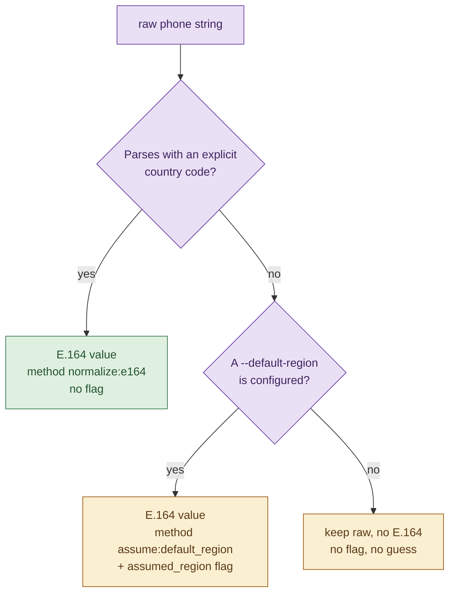

# 05. Normalization

Normalization turns a raw field value into a canonical format. The functions live
in [`normalize/`](../candidate_pipeline/normalize/), are pure (no source
knowledge, no side effects), and are called by the adapters as they read each
field. They are the front line for invariant 1: none of them ever fabricates a
value to fill a gap.

A shared principle runs through all five: **when a value cannot be safely
normalized, keep the raw value and emit nothing normalized, rather than guessing.**
The merge stage and provenance always retain the raw form, so information is never
lost by refusing to normalize.

## Phone: to E.164

[`normalize/phone.py`](../candidate_pipeline/normalize/phone.py). Uses the
`phonenumbers` library. There are exactly three cases, and the region is never
silently guessed:

- **(a) Explicit country code.** The number parses with no region hint and is
  valid: return E.164, method `normalize:e164`, no flag.
- **(b) No country code but a default region is configured.** Parse with that
  region; if valid, return E.164 with method `assume:default_region` and raise an
  `assumed_region` flag so the assumption is visible.
- **(c) No country code and no default region.** Keep the raw value, return no
  E.164, raise no flag. Guessing a region would violate invariant 1.

The default region comes from the `--default-region` CLI flag and applies to any
source that carries region-less numbers, most commonly the recruiter CSV.

## Dates: to YYYY or YYYY-MM

[`normalize/dates.py`](../candidate_pipeline/normalize/dates.py). Output is
`YYYY` or `YYYY-MM` only. Granularity is preserved: a year-only input stays a
year, because inventing a month (`-01`) would violate invariant 1.

- `"Present"`, empty, and `None` all normalize to `None`, meaning an ongoing role.
- A clean `YYYY` or `YYYY-MM` is returned directly, with the month range-checked.
  An out-of-range month such as `2020-13` is rejected, not clamped or padded.
- Free text is parsed with a deliberate trick: `dateutil` parses the string twice
  with two different default dates. A field that comes out equal across both
  parses was actually present in the input; one that differs was filled from the
  default and is therefore not real. This detects whether the month was genuinely
  supplied, so `March 2021` becomes `2021-03` while a bare `2018` stays `2018`.

This dual-default technique is the reason the parser can tell "the input contained
a month" from "dateutil invented a month," which is essential to never fabricating
granularity.

## Country: to ISO-3166 alpha-2

[`normalize/country.py`](../candidate_pipeline/normalize/country.py). Uses
`pycountry`. Best effort on free text; anything unresolvable returns `None` while
the caller keeps the raw string.

The lookup tries, in order: a two-letter alpha-2 code, a three-letter alpha-3
code, exact name matches (name, official name, common name), and finally a fuzzy
search. If the whole string does not resolve, it is split on commas, slashes, and
pipes and the tokens are tried from last to first, so `Bengaluru, India` resolves
via `India`. A value that never resolves leaves `country` as `null` with the raw
preserved, rather than picking a wrong country.

## Skills: alias map and splitting

[`normalize/skills.py`](../candidate_pipeline/normalize/skills.py), backed by
[`normalize/aliases.json`](../candidate_pipeline/normalize/aliases.json).

`canonicalize_skill` maps a raw skill to a canonical name:

1. Look up the raw string, lowercased, in the alias map. This handles forms like
   `.net` and `react.js` directly.
2. Otherwise look up a normalized-for-match form that lowercases and strips dots,
   hyphens, and whitespace but **preserves `+` and `#`**. This is what keeps
   `C++`, `C#`, and `.NET` from collapsing into `c`.
3. Otherwise keep the skill verbatim with method `verbatim`, mark it not canonical,
   and raise an `uncanonicalized_skill` flag. An unknown skill is kept, at lower
   confidence, never dropped.

`split_skills` breaks a skills string into tokens on comma, semicolon, pipe,
newline, and tab. It deliberately does not split on `/`, so `CI/CD` and `TCP/IP`
survive as single skills.

The alias map is a plain JSON table, so extending vocabulary is a data change, not
a code change. See [Extending the pipeline](13-extending.md).

## Email: lowercase and validate

[`normalize/email.py`](../candidate_pipeline/normalize/email.py). Lowercases,
strips a leading `mailto:`, trims trailing punctuation (from prose such as
`email me at a@b.com.`), and validates the shape. An invalid email returns
`None`; the adapter then drops that value but keeps the record. This is a
value-level failure, not a record-level one.

## Summary table

| Field | Canonical form | On failure | Fabrication guard |
|---|---|---|---|
| Phone | E.164 (`+` and 7 to 15 digits) | Keep raw, no E.164 | Never guesses a region |
| Date | `YYYY` or `YYYY-MM` | `None` (ongoing) or reject | Never invents a month |
| Country | ISO-3166 alpha-2 | `null`, raw kept | Never picks a wrong country |
| Skill | Canonical name from alias map | Verbatim + flag | Never drops an unknown skill |
| Email | Lowercased, validated | Drop the value | Never keeps a malformed address |

Each normalizer has focused unit tests: `test_phone`, `test_dates`,
`test_country`, `test_skills`, `test_email`, plus a `test_normalizers_edge`
suite that probes the fabrication and silent-wrong classes. See [Testing](12-testing.md).

## Where to go next

- [Identity resolution](06-identity-resolution.md) is the next stage after the normalized records are built.
- [Design decisions](10-design-decisions.md) explains why assertion-only normalization is enforced again at the projection stage.
