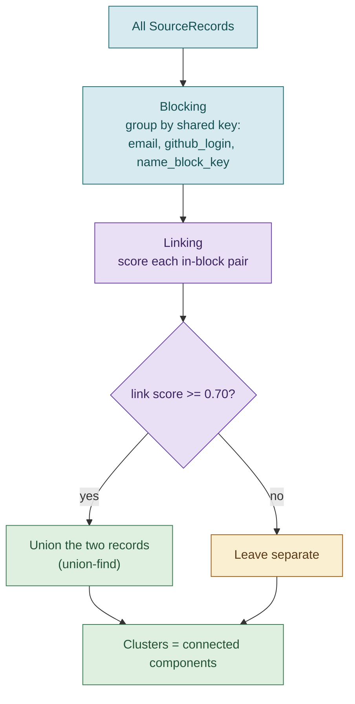

# 06. Identity resolution

Identity resolution decides which `SourceRecord`s belong to the same person and
groups them into clusters. It is implemented in
[`resolve/identity.py`](../candidate_pipeline/resolve/identity.py).

The design has two passes, a classic entity-resolution shape:

- **Blocking** is fast and high-recall. It groups records that *might* be the same
  person using cheap shared keys. It is allowed to over-group.
- **Linking** is precise. Within each block, it decides which records *actually*
  match, using positive evidence tiers.

There is no all-pairs comparison across the whole dataset. Comparisons happen only
between records that already share a block, which keeps the whole stage linear in
the number of records.



## Blocking

For each record, `_block_keys` produces a set of keys. Two records share a block
if they share any key. The keys are:

- `email:<normalized email>` for each email on the record.
- `login:<lowercased github_login>`, if present. Lowercasing means
  `Sri-Krishna` and `sri-krishna` block together.
- `name:<name_block_key>`, derived from the full name.

### The name block key

`name_block_key` is the clever part. It is the sorted set of the first letter of
every name token:

```
"Sri Krishna V"            -> {k, s, v} -> "ksv"
"Sri Krishna Vijayarajan"  -> {k, s, v} -> "ksv"
"V, Sri K."                -> {k, s, v} -> "ksv"
```

All three key to `ksv`, so they land in the same block despite reordering,
initials, and an added or dropped surname. Accents are stripped first
(`strip_accents`) and punctuation is removed, so the key is robust to formatting.
This is what lets the pipeline consider "Sri Krishna V" from a CSV and a differently
written name from GitHub as candidates for the same person, even with no shared
email.

## Linking

Within a block, `_link_score` scores each pair using positive-evidence tiers. It
is never a weighted sum, and it never penalizes a mismatch on a time-varying
attribute (someone can change city or employer without becoming a different
person).

| Evidence | Score | Constant |
|---|---|---|
| Shared normalized email, or shared github_login | 1.00 | outright link |
| Strong name-token alignment | 0.85 | `NAME_STRONG` |
| Some name alignment plus a corroborating shared phone | 0.70 | `NAME_WITH_CORROB` |
| Merely in the same block (weak signal only) | 0.60 | `INITIAL_MATCH` |

Two records link into the same cluster when the score is at least
`LINK_THRESHOLD` (0.70). So an exact email or login always links; a strong name
alignment alone links; a partial name alignment links only if a shared phone
corroborates it; and being blocked together on a name key alone (0.60) is not
enough on its own.

### Name alignment

`name_alignment` returns `strong`, `weak`, or `none`, and is order-independent and
initial-aware:

- Tokens are compared with `_token_match`, which treats a single letter as
  matching a token it prefixes, so `K` matches `Krishna`.
- The shorter token list is matched greedily against the longer.
- `strong` means every token in the shorter name matched and at least two tokens
  matched. `weak` means at least one matched. `none` means no overlap.

This is why "Sri Krishna V" and "V, Sri K." align strongly: all of the shorter
name's tokens find a match, initials included.

## Clustering with union-find

Once pairs are linked, a union-find (disjoint-set) structure groups them
transitively. If A links to B and B links to C, all three end up in one cluster
even if A and C were never directly compared. The final clusters are the
connected components. `resolve` returns a list of clusters, each a list of
`SourceRecord`s, which the merge stage then turns into one profile each.

## Worked example from the fixtures

The demo fixtures exercise the interesting cases:

- **Aisha Khan** appears in all four sources. Her CSV, ATS, and resume records
  share an email; her GitHub record shares her login and name. All four collapse
  into one cluster, linked outright by the shared identifiers.
- **Sri Krishna V** appears in the CSV (as "Sri Krishna V") and on GitHub, with no
  shared email. They block together on the `ksv` name key and the shared
  `github_login`, and link. This is the "name variants, no shared email" case.
- **Pat Morgan** appears only on GitHub, with no email, no login match to anyone,
  and a name that does not align with any other record. Pat stays an **orphan**:
  a cluster of one. This is a documented limitation, and the extension point for
  it (fuzzy name matching) is noted in [Extending the pipeline](13-extending.md).
- **Jordan Lee** appears only on GitHub, a sparse single-source profile.

## Design notes

- **Why not fuzzy match everyone against everyone?** It is O(n squared) and
  non-deterministic in ranking. Blocking plus tiered linking is O(n), fully
  deterministic, and explainable: you can always say exactly which key blocked two
  records and which tier linked them. The trade-off is that a genuine match with
  no shared block key (like Pat Morgan) stays separate. That is an accepted,
  documented limitation, discussed in [Design decisions](10-design-decisions.md).
- **Why lowercase the login?** GitHub logins are case-insensitive, so treating
  `JLee` and `jlee` as different identities would split one person in two.

## Where to go next

- [Merge and confidence](07-merge-and-confidence.md) turns each cluster into one profile.
- [Edge cases](11-edge-cases.md) lists the resolution cases covered by tests, including the deliberately descoped ones (shared inbox linking two people).
