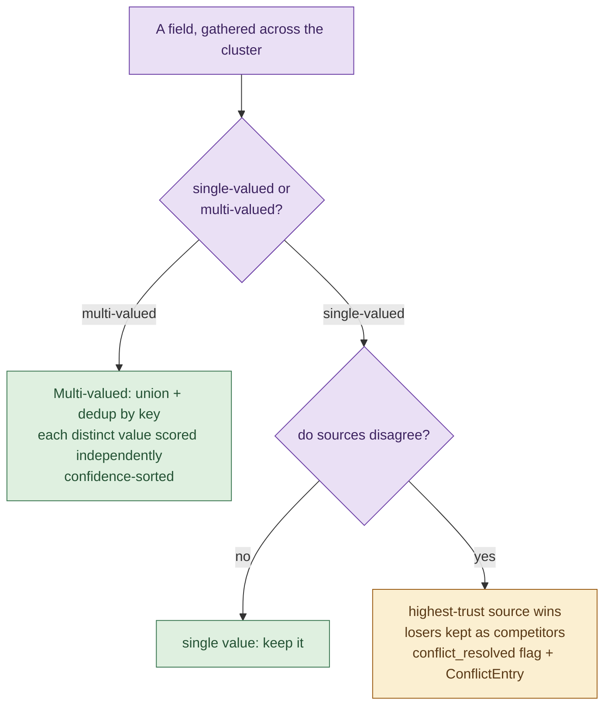

# 07. Merge and confidence

Merge turns one cluster of `SourceRecord`s into one `CanonicalProfile`. Confidence
scoring runs inside merge, attaching a 0 to 1 score to each value. The two are
documented together because they are tightly coupled: the merge strategy decides
the winner, and the scorer decides how much to trust it.

- Merge logic: [`merge/engine.py`](../candidate_pipeline/merge/engine.py) and [`merge/strategies.py`](../candidate_pipeline/merge/strategies.py).
- Trust constants: [`merge/trust.py`](../candidate_pipeline/merge/trust.py).
- Scoring: [`confidence/scorer.py`](../candidate_pipeline/confidence/scorer.py).

## Two kinds of field

Every field is merged as one of two kinds:

- **Single-valued** (name, current company, current title, location, headline):
  the sources are competing to fill one slot. Trust picks a winner.
- **Multi-valued** (emails, phones, skills): the values accumulate. The values are
  unioned and de-duplicated, and each is scored on its own.



## Trust order

Single-valued conflicts are resolved by source trust, defined in
[`merge/trust.py`](../candidate_pipeline/merge/trust.py):

```
ATS (0.90) > CSV (0.80) > resume (0.75) > GitHub (0.70)
```

The rationale: ATS is a verified system of record; the recruiter CSV is
human-entered but clean; a resume is a deliberate professional document but
self-authored and prose-extracted; a GitHub bio is public, free-text, and
self-authored. The full reasoning is in [Design decisions](10-design-decisions.md).

## Single-valued strategy

`merge_single_valued` in [`merge/strategies.py`](../candidate_pipeline/merge/strategies.py):

1. Drop empty contributions.
2. The winner is the contribution from the highest-trust source.
3. `had_conflict` is true if there are at least two distinct value-clusters (by a
   normalized key, usually lowercased and trimmed).
4. The losing distinct values are collected into `competitors` and preserved on
   the `TrackedValue`. Nothing is discarded.
5. The value is scored (see below).

When a single-valued conflict occurs on the current company, the engine raises a
`conflict_resolved` flag on the profile and appends a `ConflictEntry` to the
report, so the resolution is visible in both the profile and the batch audit
trail. In the fixtures, Aisha Khan's current company is Stripe (from ATS) over
Shopify (from a lower-trust source); the loser survives as a competitor.

## Multi-valued strategy

`merge_multi_valued`:

1. Group contributions by a normalized key.
2. For each distinct value, the representative is the highest-trust contributor,
   and the agreeing sources are all sources that offered that value.
3. Each value is scored independently, then the list is sorted by confidence
   descending. This is why a skill named by all four sources sorts above one named
   by a single source.

There is no conflict penalty for multi-valued fields, because multiple values are
expected, not contradictory.

## The confidence formulas

From [`confidence/scorer.py`](../candidate_pipeline/confidence/scorer.py):

```
single-valued = clamp01(base + corroboration - extraction_penalty - conflict_penalty) x recency
multi-valued  = clamp01(best_base + corroboration - extraction_penalty)               x recency
```

The terms:

| Term | Value | Meaning |
|---|---|---|
| `base` | winner's trust (ATS 0.90, CSV 0.80, resume 0.75, GitHub 0.70) | Starting point |
| `corroboration` | +0.05 per additional agreeing source, weighted by independence, capped at +0.10 | Agreement raises confidence |
| `extraction_penalty` | 0.10 for prose or heuristic values, 0 for structured | Free-text extraction is less reliable |
| `conflict_penalty` | 0.05, single-valued only, when two or more distinct values competed | A resolved disagreement is less certain |
| `recency` | multiplier, 1 minus up to 20 percent | Only time-varying fields decay |

### Corroboration and independence

Each additional agreeing source adds 0.05, but weighted by how independent it is:

- ATS and CSV corroborating each other count at 0.5, because they may share an
  upstream import and are not fully independent.
- Anything corroborated by GitHub counts at 1.0, because a public self-authored
  profile agreeing with a system of record is genuine independent evidence.

The total corroboration bonus is capped at 0.10, so no value can be lifted more
than two independent sources' worth.

### Extraction penalty

Values pulled from prose (a GitHub bio, free-text location, resume heuristics)
take a 0.10 penalty relative to structured fields. In the engine this is signaled
by `is_prose` on a contribution. Skills are marked prose when they did not come
through the canonical alias method.

### Recency

Only the time-varying fields (`company`, `title`, `location`, `headline`) decay.
`recency_factor` computes months of staleness from the record's `last_updated`
against the `--as-of` date and applies 1 percent decay per month, capped at 20
percent. Identifiers such as name and email never decay. A record with no
`last_updated` is treated as fully current (factor 1.0).

### Overall confidence

`overall_confidence` is a weighted sum over core fields, where an absent field
contributes 0. This means a sparse profile honestly scores lower than a complete
one.

| Field | Weight |
|---|---|
| name | 0.25 |
| email (first) | 0.20 |
| phone (first) | 0.15 |
| company (current) | 0.15 |
| title (current) | 0.15 |
| location | 0.10 |

In the fixtures this produces: Aisha Khan 0.906 (four sources, nearly complete),
Sri Krishna V 0.785, Jordan Lee 0.435 (GitHub only), Pat Morgan 0.295 (orphan,
minimal fields).

## Assembling the profile

Beyond the field strategies, `MergeEngine.merge` does several structural jobs:

- **candidate_id.** A deterministic SHA1 of the strongest stable anchor (email,
  then phone, then name key). See [Data model](03-data-model.md).
- **Location, headline, links, repos.** Location and headline use the
  single-valued strategy with recency; links and repos are unioned. The top two
  starred repos become `links.other`, and repos are star-sorted.
- **Experience reconciliation.** The current role (an experience entry with
  `end == None`) is the single source of truth for current company and title. A
  flat `current_company` or `current_title` from a source with no structured
  experience is reconciled into that current entry. Past roles are grouped by a
  key of company, title, and start.
- **years_experience.** Past and current roles are turned into month intervals,
  overlapping intervals are merged, and the total is returned in years. An
  unparseable start skips that interval rather than inventing one; an unparseable
  end on an otherwise valid interval is treated as ongoing. This upholds invariant
  1 while still producing a number when the data supports it.
- **Lifting flags.** Normalization-time flags on the source records
  (`assumed_region`, `uncanonicalized_skill`) are de-duplicated and lifted onto the
  profile, and any phone resolved via the default region also produces an
  `Assumption` in the report.

## Where to go next

- [Projection and configuration](08-projection-and-config.md) turns the profile into output.
- [Design decisions](10-design-decisions.md) explains the trust order, the independence weights, and why competitors are never discarded.
