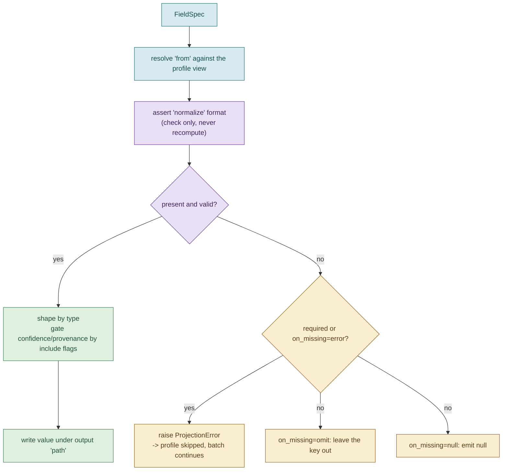

# 08. Projection and configuration

Projection turns a `CanonicalProfile` into an output dict. It is the only stage
that reads the runtime configuration, and it is where the pipeline's flexibility
lives: the same canonical data can be reshaped into different output schemas
without any code change.

- Config models: [`config/schema.py`](../candidate_pipeline/config/schema.py).
- Config loading: [`config/loader.py`](../candidate_pipeline/config/loader.py).
- Projection: [`project/projector.py`](../candidate_pipeline/project/projector.py).
- Path resolution: [`project/resolver.py`](../candidate_pipeline/project/resolver.py).
- Output validation: [`project/validator.py`](../candidate_pipeline/project/validator.py).

## The configuration format

A configuration is a JSON document with a global section and an ordered list of
field specifications.

```json
{
  "on_missing": "null",
  "include_flags": true,
  "fields": [
    { "path": "candidate_id", "type": "string", "required": true },
    { "path": "full_name", "type": "string" },
    { "path": "skills", "type": "object[]", "include_confidence": true }
  ]
}
```

### FieldSpec

Each entry in `fields` is a `FieldSpec`:

| Key | Meaning |
|---|---|
| `path` | The output key. Must be unique across the config. |
| `from` | The canonical source path to read. Defaults to `path` if omitted. |
| `type` | One of `string`, `string[]`, `number`, `object`, `object[]`. Drives the dynamic validation model. |
| `required` | If true, a missing value is a hard error that drops the profile. |
| `normalize` | An assertion (not a recompute). One of `E164`, `iso3166-a2`, `canonical`. |
| `on_missing` | Per-field override of the global policy: `null`, `omit`, or `error`. |
| `include_confidence` | If true, wrap a scalar value with its confidence. |
| `include_provenance` | If true, include the value's provenance trail. |

### Global keys

- `on_missing` sets the default missing-value policy for all fields.
- `include_flags`, if true, appends the profile's `flags` array to the output.

### Validation at load time

`ProjectionConfig` rejects a configuration with a duplicate or empty output
`path` when it loads. A duplicate would silently overwrite an earlier field,
which is data loss, so it is a load-time error rather than a subtle output bug.
The loader opens with `utf-8-sig` so a config with a byte-order mark still parses.

## The path mini-language

`from` uses a small path language, implemented in
[`project/resolver.py`](../candidate_pipeline/project/resolver.py) without any
external JSONPath dependency. Four composable forms:

| Form | Meaning | Example |
|---|---|---|
| `field` | A plain key | `full_name` |
| `field.subfield` | A nested key | `location.city` |
| `field[].subfield` | Map over a list, taking `subfield` from each element | `skills[].name` |
| `field[N]` | Index into a list | `emails[0]` |

These compose across dotted segments, so `repos[0].name` reads the name of the
first repo, and `skills[].name` produces a flat list of skill names. A path that
does not resolve returns a missing marker, which the projector then handles by the
`on_missing` policy.

## The projection pipeline for one field



The projector first builds a plain-dict "view" of the profile (tracked values
become `{value, confidence, sources, provenance}` dicts), then processes each
field spec in order.

## Assertion-only normalization

This is a deliberate and important design point. All real normalization already
happened upstream in the adapters (see [Normalization](05-normalization.md)). A
config's `normalize` is therefore an **assertion**, not a recompute:

- `E164` checks the value matches `^\+\d{7,15}$`.
- `iso3166-a2` checks it matches `^[A-Z]{2}$`.
- `canonical` checks that `canonicalize_skill` returns the same string, meaning it
  is already a canonical skill name.

If the assertion fails, the value is treated as **missing** and handled by the
`on_missing` policy. The projector never re-runs a normalizer. This rules out
double-normalization and any drift between the canonical model and the output: a
value is normalized exactly once, at ingestion, and only ever checked afterward.
The reasoning is expanded in [Design decisions](10-design-decisions.md).

## Missing values and required fields

For each field, the effective policy is the field's `on_missing` if set, otherwise
the global `on_missing`:

- `null` emits the key with a `null` value.
- `omit` leaves the key out of the output entirely.
- `error`, or `required: true`, raises a `ProjectionError`. The pipeline catches
  it, records a `projection` skip in the report, drops that one profile, and
  continues with the rest of the batch.

This is how the custom config drops Pat Morgan: `primary_email` is
`required: true`, Pat has no email, so the profile is dropped from that output
while still appearing in the default output.

## Built-in views

Two output shapes are computed by the projector rather than read from a canonical
field:

- The `@provenance` sentinel source builds a flattened, de-duplicated aggregate of
  every field's provenance (which source and method produced each field). The
  default config surfaces this as the `provenance` key.
- `include_flags` at the global level appends the profile's `flags` array.

## Output validation

After a profile is projected, [`project/validator.py`](../candidate_pipeline/project/validator.py)
validates it. `build_output_model` uses Pydantic's `create_model` to construct a
model *from the config* at runtime: each field's declared `type` becomes the
model's type, `required` fields are mandatory, and scalar fields that include
confidence or provenance are typed as objects. A profile that fails validation is
skipped with a `validation` entry in the report, and the batch continues. The
model is built once per run and reused across profiles.

## Default versus custom, side by side

The two shipped configs show the range. Same canonical data, no code change.

| Aspect | `default_config.json` | `custom_config.json` |
|---|---|---|
| Global `on_missing` | `null` | `omit` |
| `include_flags` | true | false |
| Field naming | Canonical names (`full_name`, `emails`) | Renamed (`name`, `primary_email`) |
| Skills | `object[]` with confidence | Flat `string[]` via `skills[].name`, asserted `canonical` |
| Confidence and provenance | Provenance aggregate included | Inline on `name` and `location` only |
| Required fields | `candidate_id` | `name`, `primary_email` (drops Pat Morgan) |
| Uses path language | `@provenance` sentinel | `emails[0]`, `skills[].name`, `repos[0].name` |

Run both and compare, as shown in the top-level [README](../README.md), or use the
`demo.sh` helper. Validate a config on its own with `candidate-pipeline
validate-config`.

## Where to go next

- [CLI reference](09-cli-reference.md) covers how a config is passed and how output is written.
- [Extending the pipeline](13-extending.md) shows how to write a new config for a new consumer.
